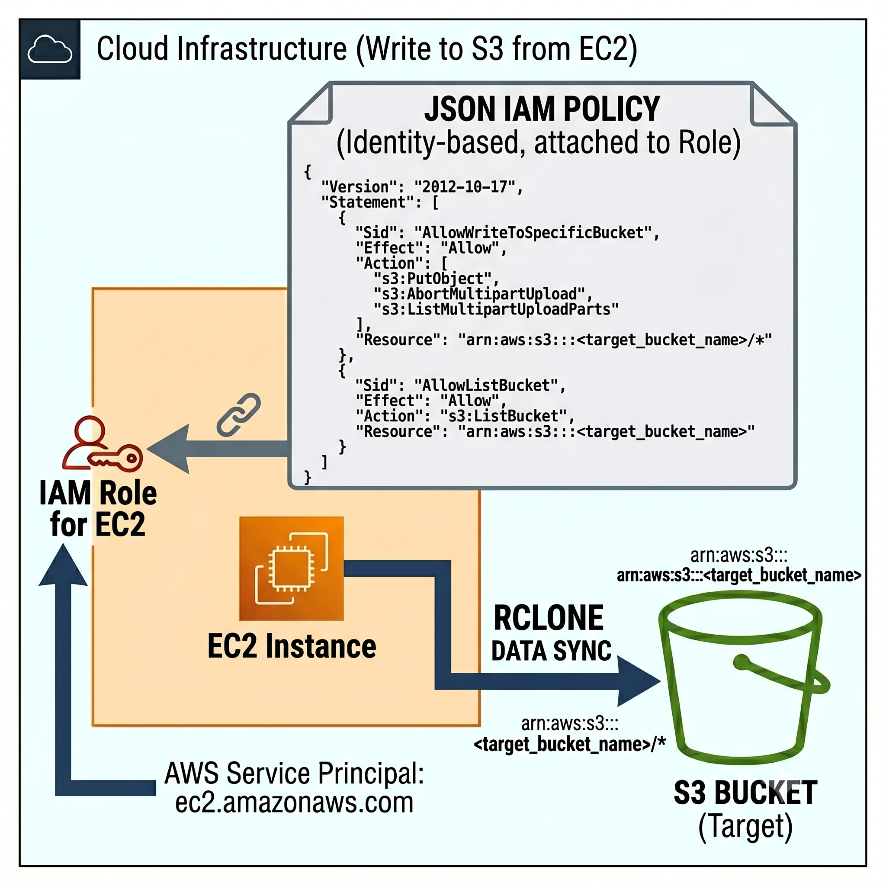

### Telemetry archiver

This repository creates backups of monitoring systems like Grafana and Uptime Kuma running on a Docker Compose setup. The script gracefully stops the containers, archives their data, and uses `rclone` to transfer it to an S3 bucket with the Deep Archive storage class (which saves costs compared to other S3 tiers).



## Requirements

- An instance with a service role attached, running the Grafana/Uptime Kuma stack you use for monitoring your systems
- An S3 bucket, spun up using the Terraform configuration in this repo

## How to set up

### 1. Attach the service role to your instance

This grants the EC2 instance permission to list buckets and read/write to the one bucket that will be created.

Do this manually: go to **EC2 > Instance > select your instance > Actions > Security > Modify IAM role > Create a new IAM role**, then paste in the contents of `instance-role.json`.

### 2. Create the bucket using Terraform

Terraform configuration is in the `/terraform` directory of this repo.

```bash
terraform init
terraform plan && terraform apply -auto-approve
```

### 3. Configure the backup source directories

Edit the following file to customize which sources are backed up:

```bash
telemetry-archive/ansible/roles/backup-role/files/backup.conf
```

### 4. Run the Ansible playbook

This provisions the `tsbackup` user and configures the required permissions. An inventory file is required.

The Ansible files are in the `ansible/` directory.

```bash
ansible-playbook playbook.yml -i inventory
```